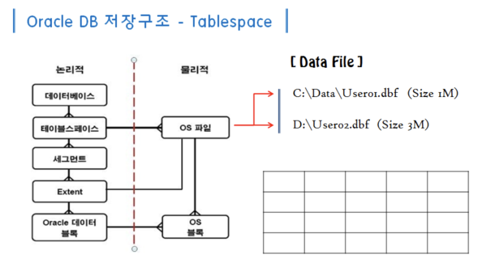

# 1.3 데이터 저장 구조 및 I/O 메커니즘

## 1.3.1 SQL이 느린 이유

> sql이 느린 이유 : **디스크 I/O**   

하나의 CPU는 한 번에 하나의 프로세스를 처리한다.  
그런데 그 프로세스가 I/O작업을 하게 되면 I/O작업이 끝날 때까지 대기 상태로 머문다.  
여러 프로세스들과 경합에서 자원을 할당받은 프로세스가 열심히 일해야 하는 시간에 대기하는 것이다.  
sql의 지연은 바로 이 대기 시간때문에 발생한다.
---

## 1.3.2 데이터베이스 저장 구조

데이터베이스의 저장 구조는 다음과 같이 논리적 구조와 물리적 구조로 나눌 수 있다.



```
* 블록 : 데이터를 읽고 쓰는 단위
* 익스텐트 : 세그먼트의 저장 공간을 확장하는 단위
* 세그먼트 : 데이터 저장공간이 필요한 오브젝트(테이블, 인덱스, LOB 등)
* 테이블 스페이스 : 세그먼트를 담는 컨테이너
```

* 하나의 세그먼트에 해당하는 익스텐트는 같은 데이터파일에 위치하지 않을 수 있다.  
* 이는 파일 경합을 줄이기 위해 여러 데이터파일로 분산해서 저장하기 때문이다.

---

## 1.3.3 블록 단위 I/O

데이터베이스에서 데이터를 읽고 쓰는 단위 : `블록`

* 하나의 레코드를 읽을 때도 블록을 통째로 읽는다.  
* 오라클의 기본 블록 크기는 8kb 이다.

---

## 1.3.4 시퀀셜 액세스 vs 랜덤 액세스

### (1) 시퀀셜 액세스

> 물리적 혹은 논리적 순서에 따라 블록을 읽는 방식

 인덱스 리프 블록의 경우
* 인덱스 리프 블록은 앞뒤를 가리키는 주소값을 통해 논리적으로 연결되어 있다.
* 주소값 대로 순차적으로 블록을 읽는다.

테이블 블록의 경우
* **익스텐트 목록을 세그먼트 헤더에 맵**으로 관리. 이 맵에는 각 **익스텐트의 첫 번째 블록 주소 값이 저장**되어 있다. 
* 각 익스텐트의 첫 번째 블록부터 순서대로 읽는 것이 Full Table Scan이다.

### (2) 랜덤 액세스

> 논리적/물리적 순서를 따르지 않고, 레코드 하나를 읽기 위해 한 블록씩 접근하는 방식

---

## 1.3.5 논리적 I/O vs 물리적 I/O

### DB 버퍼 캐시

* 디스크에서 읽어 들인 데이터를 `DB 버퍼 캐시`에 저장한다
* 이를 통해 반복적인 디스크 I/O Call을 줄일 수 있다.

### 논리적 I/O

* DB 버퍼 캐시를 통해 데이터를 가져오는 것을 논리적 I/O라고 한다.
* 주의할 점은 논리적 I/O는 DB 버퍼 캐시에서 **바로 찾은** 경우를 의미하지 않는다.
* 디스크 I/O를 통해 데이터를 가져오더라도 DB 버퍼 캐시를 경유하기 때문에 결국 논리적 I/O는 **총 읽은 블록 수**가 된다.

### 물리적 I/O

* DB 버퍼 캐시에 데이터가 없어 디스크에 접근하여 데이터를 가져오는 것을 물리적 I/O라고 한다.
* 논리적 I/O는 전기적 신호인데 반해 물리적 I/O 는 실제로 디스크에서 데이터를 가져오기 때문에 논리적 I/O에 비해 훨씬 느리다.

### 버퍼캐시 히트율(BCHR)

버퍼캐시의 효율을 측정하는 지표로 공식은 다음과 같다.
```
BCHR = ( 캐시에서 곧바로 찾은 블록 수 / 총 읽은 블록 수 ) * 100
     = ( (논리적 I/O - 물리적 I/O) / 논리적 I/O) * 100
```

* 버퍼캐시 히트율을 높이는데 가장 중요한 것은 물리적 I/O 를 줄이는 것이 아니다.
* **논리적 I/O 를 줄이는 것**이 버퍼캐시 히트율에 가장 큰 영향을 미친다.(논리적 I/O는 분모이기 때문에 아무리 물리적 I/O가 적다한들 소용 없다.
* 즉 sql의 성능 향상을 위해서는 `총 읽은 블록 수`를 줄이는 것이 핵심이다.

---

## 1.3.6 Single Block I/O vs Multiblock I/O

### Single Block I/O

* 한번의 I/O Call에서 하나의 block을 가져오는 것.
* 일반적으로 인덱스를 사용할 때는 Single Block I/O 를 사용한다.
* 따라서 소량 데이터를 읽을 때 효율적이다.

### Multiblock I/O

* 한번의 I/O Call에서 여러개의 block을 가져오는 것.
* 대용량 데이터를 한꺼번에 가져올 때 효율적이다.

---

## 1.3.7 Table Full Scan vs Index Range Scan

### Table Full Scan

* 시퀀셜 액세스 + Multiblock I/O
* 즉 데이터를 한꺼번에 순서대로 읽는 방식이다.

### Index Range Scan

* 랜덤 액세스 + Singleblock I/O
* 데이터에 임의로 접근하여 작은 단위로 읽는 방식이다.

### Table Full Scan vs Index Range Scan

* Table Full Scan 이라고 무조건 느린 것이 아니고, Index Range Scan 이라고 무조건 빠르지 않다.
* **대량의 데이터를 가져와 한번에 작업**하는 경우 (배치, 통계 등)에서는 한번에 많이 처리하는 `Table Full Scan` 방식이 빠르다.
* **대용량의 데이터에서 소량의 데이터를 검색**하는 경우(검색 등)에는 임의로 접근할 수 있는 `Index Range Scan` 방식이 빠르다.

---

## 1.3.8 캐시 탐색 매커니즘

### 메모리 공유자원에 대한 액세스 직렬화

* 버퍼시는 SGA의 구성요소이므로, 버퍼캐시에 저장된 데이터는 공유된다.  
* 이 때 버퍼캐시의 사용은 동시에 이뤄지지 않고 순차적으로 접근하도록 구현되어 있는데, 이를 `래치`라 한다.
* 래치는 일종의 버퍼 캐시 자물쇠이다. 해당 자격이 있는 프로세스만이 데이터에 접근하도록 하는 것이다.
* 이러한 (잠그는) 방식은 결국 여러 프로세스가 접근 할 때 캐시 I/O 의 지연을 발생 시킨다.
* 이러한 지연을 줄이는 방법 또한 결국 `논리적 I/O 수를 줄이는 것`이다. 