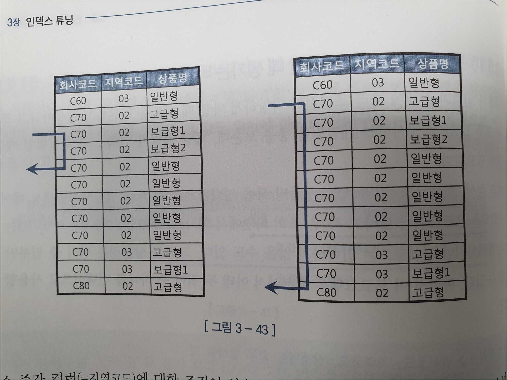
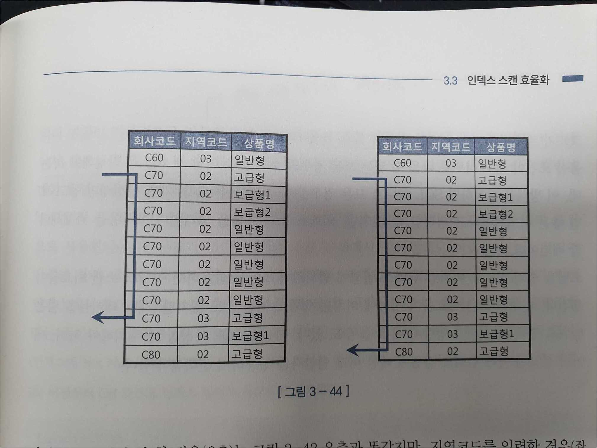

# 3.3.9 BETWEEN과 LIKE 스캔 범위 비교

### 결론

범위 표현을 위해서는 LIKE 보다는 BETWEEN 연산자를 사용하자.

### 원인

범위 조건에서 LIKE와 BETWEEN 중 어떤 것을 사용하는가에 따라 스캔 범위가 달라진다.  

### 예시
between 의 경우
```sql
WHERE 판매월 BETWEEN '201901' AND '201912'
AND 판매구분 = 'B'
```
* 201901 이면서 **B인 레코드에서 스캔을 시작**할 수 있다.(201901 이면서 A인 레코드 생략 가능)

like 의 경우
```sql
WHERE 판매월 LIKE '2019%';
AND 판매구분 = 'B'
```
* **201900 이 스캔 시작점**이 되기 때문에 201901이면서 A인 레코드도 전부 스캔해야 함.

*스캔 종료 지점을 정하는 것 역시 BETWEEN이 더 유리하다.(ex. 판매구분이 A일 경우)*

## 3.3.10.1 범위검색 조건을 남용할 때 생기는 비효율 - LIKE

### 결론
옵션 조건을 처리할 때 LIKE 연산자를 사용하지 말자.

### 예시
(1) 올바른 예  
지역코드는 옵션조건일 때, 지역코드의 유무에 따라 아래의 두 쿼리 중 하나가 실행된다.
```sql
쿼리1
SELECT * FROM 가입상품
WHERE 회사코드 =:COM
AND 지역코드 =:REG              -- 지역코드가 조건절에 추가됨
AND 상품명 LIKE :PROD || '%'

쿼리2
SELECT * FROM 가입상품
WHERE 회사코드 =:COM
AND 상품명 LIKE :PROD || '%'
```



왼쪽은 회사코드, 지역코드, 상품명에 'C70', '02', '보급'을 입력한 경우이고(쿼리1)  
오른쪽은 이 중 지역코드를 입력하지 않은 경우이다.(쿼리2)

* 왼쪽은 **회사코드, 지역코드, 상품명이 모두 액세스 조건**이 되어 스캔 범위가 상당히 줄었다.  
* 오른쪽은 회사코드만 액세스 조건이 되어 스캔범위가 넓지만 왼쪽과 오른쪽의 스캔범위 평균은 비교적 적은 것을 알 수 있다. 

(2) 잘못된 예

지역코드를 LIKE 연산자로 처리할 때 쿼리는 다음과 같다.
```sql
SELECT * FROM 가입상품
WHERE 회사코드 =:COM
AND 지역코드 LIKE :REG || '%'     -- 옵션 조건을 LIKE로 처리
AND 상품명 LIKE :PROD || '%'
```


* 지역코드를 입력했을 때의 스캔 범위가 별로 줄어들지 않는다. **회사코드, 지역코드만 액세스 조건**이기 때문이다.

## 3.3.10.1 범위검색 조건을 남용할 때 생기는 비효율 - BETWEEN

### 결론
옵션 조건을 처리할 때 BETWEEN 연산자를 사용하지 말자.

### 예시
```sql
SELECT * FROM 일별종목거래
WHERE 거래일자 BETWEEN :시작일자 AND :종료일자
AND 종목코드 BETWEEN :종목1 AND :종목2
```
위의 쿼리에서  
거래일자가 옵션 조건일 경우 시작일자를 '1900'으로 하고 종료일자를 '2999'로 지정한다면  
전체범위를 모두 스캔하는 것이다. 매우 비효율적이다.

## 3.3.11 다양한 옵션 조건 처리 방식의 장단점 비교

### (1). OR 조건 활용

```sql
SELECT * FROM 거래
WHERE (:CUST_ID IS NULL OR 고객ID = :CUST_ID)
AND 거래일자 BETWEEN :DT1 AND :DT2
```

* 위의 쿼리의 경우 고객ID가 선두 컬럼이기 때문에 OR Expansion이 작동하지 않는다. 따라서 '고객ID + 거래일자'로 구성된 인덱스를 사용할 수 없다.
* 인덱스를 '거래일자 + 고객ID'로 구성하더라도, 고객ID를 테이블 액세스 단계에서 필터링하기 때문에 비효율적이다.

### OR 조건을 사용할 수 있는 경우

* 인덱스 액세스 조건으로 사용 불가
* 인덱스 필터 조건으로도 사용 불가
* 테이블 필터 조건으로만 사용 가능
* 인덱스 구성 컬럼 중 하나 이상이 Not Null 일 경우 인덱스 필터 조건으로 사용 가능(18C 버전이상)

### (2). LIKE/BETWEEN 조건 활용

LIKE/BETWEEN 패턴을 사용할 수 있는 경우

1). 인덱스 선두 컬럼으로 사용x

인덱스가 '고객ID + 거래일자'일 경우
```sql
SELECT * FROM 거래
WHERE 고객ID LIKE :cust_id || '%'
AND 거래일자 BETWEEN :dt1 AND :dt2
```
* 고객ID를 입력하지 않을 경우 **모든 고객에 대한 레코드**를 거래일자로 필터링함.

2). null 허용 컬럼에서 사용x

* 위의 sql에서 :cust_id 대신 null이 들어갈 경우 실제로 null인 데이터는 결과에서 누락된다.

```sql
where null LIKE null || '%'
선택된 레코드가 없습니다.
```

3) 인덱스 액세스 조건이 숫자형 컬럼인 경우 사용x

* 인덱스 액세스 조건이 숫자형일 경우 like를 사용하면 자동으로 형변환이 일어난다.(문자열로)
* 가공한 컬럼에 대해서는 인덱스 스캔이 발생하지 않는다.

4) 가변 길이 컬럼의 경우 사용x

* '김훈'을 입력한 경우 '김훈남'과 같이 김훈이 들어가는 다른 길이의 레코드까지 조회하면서 스캔 범위가 넓어진다.

### (3). UNION ALL 활용

```sql
SELECT * FROM 거래
WHERE :cust_id IS NULL          -- 고객ID 조건이 없을 경우
AND 거래일자 BETWEEN :dt1 AND :dt2
UNION ALL
SELECT * FROM 거래
WHERE :cust_id IS NULL
AND 고객ID = :cust_id             -- 고객ID 조건이 있을 경우
AND 거래일자 BETWEEN :dt1 AND :dt2
```
* :cust_id 변수 입력 여부와 상관 없이 인덱스를 사용할 수 있다.
* 단점을 쿼리가 길어진다는 것이다.

### (4). NVL/DECODE 함수 활용

```sql
SELECT * FROM 거래
WHERE 고객ID = nvl(:cust_id, 고객ID)
AND 거래일자 BETWEEN :dt1 AND :dt2
```
* 이 방법을 이용하면 :cust_id가 null일 경우 거래일자를 인덱스로 사용하고, :cust_id가 null이 아닐 경우 고객ID + 거래일자를 인덱스로 사용한다.
* 단점은 앞서 나온 LIKE 패턴처럼 NULL 허용 컬럼에서 사용할 수 없다.

### (5). 옵션 조건 처리 방식일 때 개인적인 결론

* OR / LIKE / BETWEEN 을 사용하지 않는 것이 좋다. 사용해야만 하는 상황이면 위의 사항을 고려해야 한다.
* Mybatis와 같은 동적 SQL을 사용하면 위의 문제를 해결할 수 있다.
* JPA와 같은 ORM이라면 어플리케이션 레벨에서 분기처리 해주는 것이 좋을 것 같다.

## 3.3.12 함수호출부하 해소를 위한 인덱스 구성

PL/SQL 함수가 느린 가장 큰 이유는 Recursive call 때문이다.  
이 방식은 결과 로우가 100만 건이면 PL/SQL 함수를 100만 번 실행시킨다.

이러한 함수호출부하를 줄이는 것은 결국 **액세스 조건을 고려한 인덱스 구성**을 하는 것이다.
```sql

select * from 회원
where 암호화된_전화번호 = encryption(:phone_no)
```
* 위 방식은 데이터가 100만 건일 경우 함수가 100만 번 호출 된다.

```sql

select * from 회원
where 생년 = '1987'
and 암호화된_전화번호 = encryption(:phone_no)
```
생년 + 암호화된_전화번호로 구성된 인덱스일 경우 액세스 조건에 따라 필터링 된 횟수만큼만 함수가 호출된다.