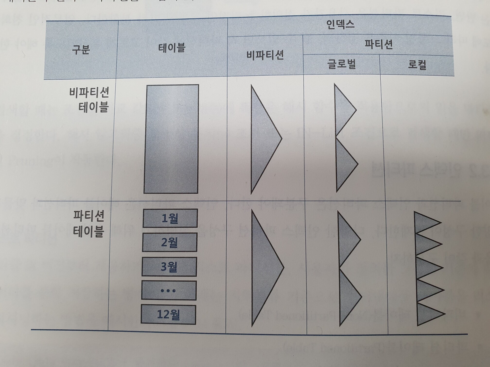
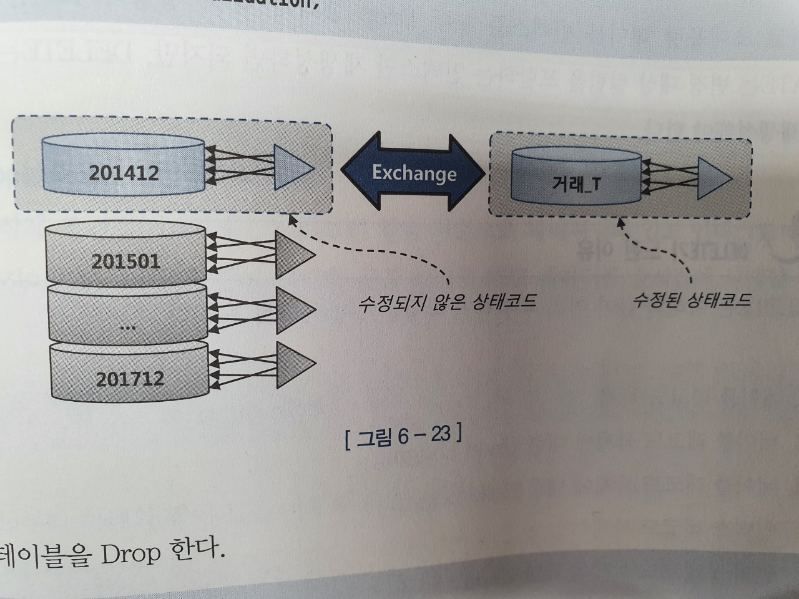
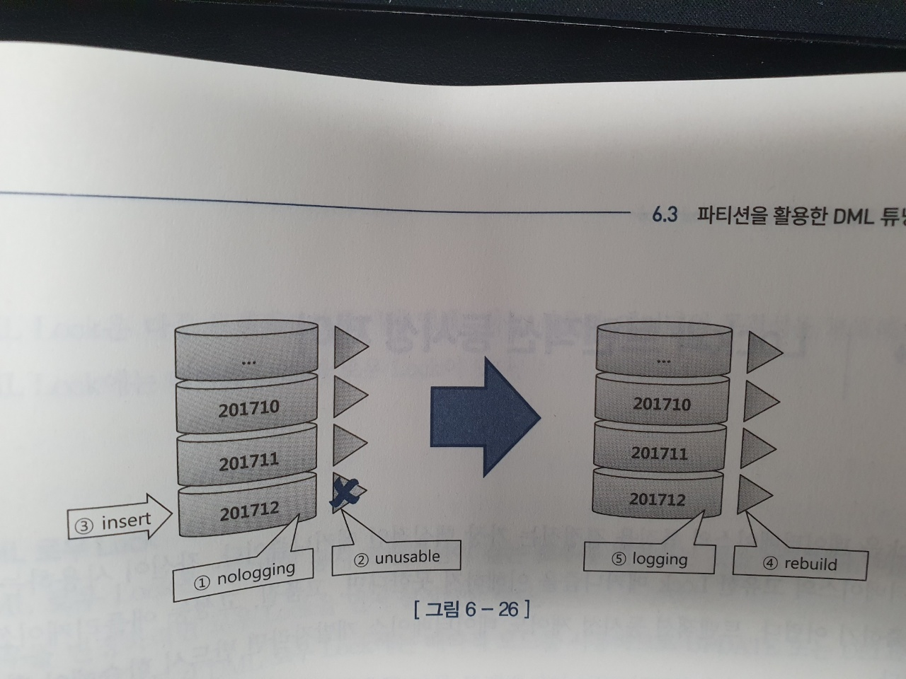

# 6.3 파티션을 활용한 DML 튜닝


### 파티션이란
- 하나의 테이블 또는 인덱스를 파티션 키에 따라 별도 세그먼트에 저장하는 것
- 논리적으로는 하나의 테이블이지만 실제로 물리적으로는 여러 개의 테이블의 효과

### 파티션이 필요한 이유
- 관리적 측면 : 파티션 단위의 작업 -> 같은 테이블이라도 서로 다른 파티션에 영향을 미치지 않음 -> 가용성 향상
- 성능적 측면 : 경합 또는 부하 분산

## 6.3.1 테이블 파티션

### (1). 파티션 테이블의 성능 향상 원리
* 파티션 테이블의 성능 향상 원리는 파티션 pruning을 통해 sql파싱이나 실행 시점에 조건절을 분석하여 **다른 파티션 세그먼트를 액세스 대상에서 제외**하는 것에 있다.
* 예를 들어 파티션이 적용되지 않은 테이블에 1000만건의 데이터가 있다면 1000만 건 중 조건에 따른 데이터를 필터링 하지만,
* 파티션이 적용된 경우 1000만건 중 파티션닝이 된 테이블만 액세스 하여 필터링 하기 때문에 성능상 이점이 있다.

### (2). range 파티션
* 날짜 컬럼과 같이 범위 값을 기준으로 파티셔닝
* 보관 주기 정책에 따라 관리가 달라지는 경우 효율적 (ex. 1년만 보관하고 백업하는 로그 테이블)

### (3) 해시 파티션
* 파티션 개수만 사용자가 결정하고 데이터를 분산하는 알고리즘은 오라클 내부 해시함수가 결정
* 해시 알고리즘 특성상 등치 조건 또는 In-List 조건에서만 파티션 Pruning이 작동

### (4) 리스트 파티션

* 해시 파티션은 오라클 내부의 해시 알고리즘에 따라 임의로 분할하는 반면, 리스트 파티션은 사용자가 정의한 논리적인 그룹에 따라 분할
* 예를 들어 사용자가 지역별로 파티션 키를 설정하면, '서울', '경기', '부산' 등과 같은 논리적 기준에 따라 파티셔닝 된다.

### 인덱스 파티션

### (1). 로컬 파티션 인덱스
* 각 테이블 파티션과 1:1로 대응 되는 인덱스 파티션.
* 예를 들어 테이블이 월별로 파티셔닝 되어 있다면, 각각의 파티셔닝 테이블에 마찬가지로 인덱스가 만들어 진다.  
* 인덱스 파티션은 테이블 파티션의 속성을 그대로 상속 받는다. 따라서 `테이블 파티션 키 == 인덱스 파티션 키`가 된다.
* 파티션 테이블이 변경 되면 로컬 파티션 인덱스도 이에 맞추어 오라클이 자동으로 변경해 준다.

> quiz
```
파티셔닝 되지 않은 테이블의 경우 로컬 파티션 인덱스가 존재 할까요?
```

### (2). 글로벌 파티션 인덱스

* 파티션을 테이블과 다르게 구성한 인덱스. 로컬 인덱스가 아니면 **모두 글로벌 파티션 인덱스**이다.
* 파티션 유형이 다르거나, 파티션 키가 다르거나, 파티션 기준값 정의가 다른 경우
* 테이블 파티션 구성을 변경하는 경우 Unusable 상태로 바뀌므로 재생성해야 한다.

### (3). 비파티션 인덱스

* 파틱셔닝 되지 않은 인덱스
* 비파티션 인덱스와 파티션 테이블과 조합될 때, 테이블에 변경이 있으면 인덱스를 재생성해야 한다. 




## 6.3.3 파티션을 활용한 대량 update 튜닝

10억 건의 데이터가 저장된 테이블에서 5%(5000만 건)의 데이터 변경이 있을 경우

### 1) 5000만 건을 update
-> 5000 만 건에 대한 select/update, 그리고 index 수정에 대한 부담 발생 

### 2). index 를 drop 하고 5000만 건을 update
-> 10억 건에 대한 index 재생성 부담 발생

### 3). 파티션 exchange를 이용
* 테이블이 파티셔닝이 되어 있고 인덱스도 로컬 파티션으로 구성되어 있을 경우 가능
```sql
(1). 먼저 임시 테이블을 만들고
(2). 임시 테이블에 update 될 데이터를 insert
(3). 임시 테이블에 인덱스를 생성
(4). 기존 파티션 테이블과 임시 테이블을 exchange
(5). 임시 테이블 drop
```


## 6.3.4 파티션을 활용한 대량 delete 튜닝

update 는 변경 대상 컬럼을 포함하는 인덱스만 재생성하면 되지만, delete는 모든 인덱스를 재생성 해야 하기 때문에  
인덱스 재생성 비용이 더 크다.

### 1) 파티션 drop을 이용한 대량 데이터 삭제

* 삭제 조건절 컬럼 기준으로 파티셔닝 되어 있고, 로컬 인덱스일 경우 간단히 삭제 가능
* 예를 들어 월별로 파티셔닝 되어 있고, 1월 파티션을 통째로 삭제하는 경우
```sql
alter table 거래 drop partition p201412;
```

### 2) 파타션 truncate를 이용한 대량 데이터 삭제
* 위와 같이 파티셔닝 기준으로 일괄 삭제하지 않고 또 다른 삭제 조건이 있는 경우
* 지워야할 데이터가 대다수라면, 데이터를 지우는 것 보다 전부 삭제 후 남길 데이터를 insert 하는 것이 낫다.
```sql
(1). 임시 테이블 생성, 남길 데이터만 insert
(2). 삭제 대상 테이블 파티션을 truncate
(3). 임시 테이블에 복제한 데이터를 원본 테이블에 insert   (insert select 사용)
(4). 임시 테이블 drop
```

## 6.3.5 파티션을 활용한 대량 insert 튜닝

### 1) 비파티션 테이블일 때
* 비파티션 테이블에서 대량 데이터를 insert 할 때, 인덱스를 unusable 시킨 후 재생성하는 방식이 더 빠를 수 있다.

### 2) 파티션 테이블일 때
테이블이 파티셔닝돼 있고, 로컬 인덱스라면 파티션 단위로 인덱스를 재생성 할 수 있다.




